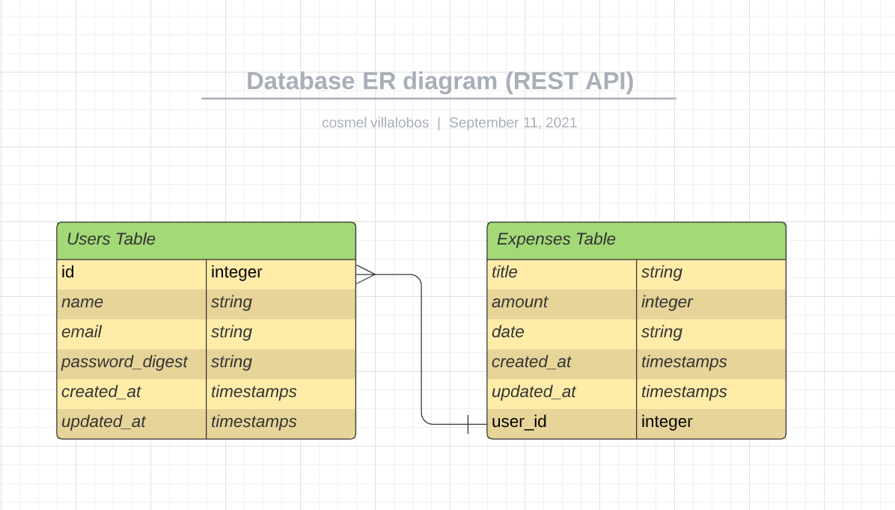

# REST API in Rails

> Project was about creating a RES API in rails
> that can be consume in the Front End Using React and RTK Query
> based on the following ERD Model
> 

## Built With

- Rubuy
- Rails
- PostgreSQL

## Live Demo

[Live Demo Link](https://lavista-authentication-api.herokuapp.com)

## Getting Started

**To get a copy of the code please click on the green button on the top right corner that says Code**

### Prerequisites

- Ruby:3.0.1
- Rails:6.1.3
- PostgreSQL:12.5

### Install

**Now to clone it to your local machine please open your terminal and paste this code `git@github.com:cvilla714/rails-auth.git`**

**Then you can go into the directory by typig `cd rails-auth`**

**Finally just type this command `bundle install` this will install all of the gems for the project**

### Usage

**Once you have gone through the process of installation now run the following command `rails s` this will start the server and open in your browser a new tab where you will be able to see the API**

### Test

**In order to run the test please type the following command from the terminal `rspec --format=documentation`**

## Authors

👤 **Cosmel Villalobos**

- Github: [@cvilla714](https://github.com/cvilla714)
- Twitter: [@kckeyti](https://twitter.com/kckeyti)
- LinkedIn: [Cosmel Villalobos](https://www.linkedin.com/in/cosvilla/)

## 🤝 Contributing

Contributions, issues, and feature requests are welcome!

Feel free to check the [issues page](https://github.com/cvilla714/rails-auth/issues).

## Show your support

Give a ⭐️ if you like this project!

## Acknowledgment

- Microverse
- Gregoire Vella on Behance

## 📝 License

This project is [MIT](https://github.com/cvilla714/rails-auth/blob/master/LICENSE) licensed.
